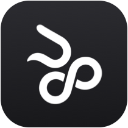

<!-- These icon copies are pre-blended onto GitHub's page colors, so nothing
     transparent is painted behind them. -->

  <picture>
    <source media="(prefers-color-scheme: dark)" srcset="images/icon-dark.png">
    
  </picture>

<h1 align="center">N8Island</h1>

  <strong>Your Mac. Within reach.</strong> 
  Apps, windows, files, music, messages, and everyday controls, 
  together in a native space at the top of your Mac.

  <a href="https://n8island.com/download">Download</a> ·
  <a href="https://n8island.com">Website</a> ·
  <a href="https://n8island.com/gallery">Gallery</a> ·
  <a href="https://n8island.com/privacy">Privacy</a> ·
  <a href="../../issues">Support</a>

  <picture>
    <source media="(prefers-color-scheme: dark)" srcset="https://n8island.com/stills/home-page-dark-1200.webp">
    
  </picture>

N8Island is a Mac app that turns the space around the notch into a place for
the things you reach for all day. Hover to open it, click to pin it. It ships as
a notarized Developer ID build, straight from [n8island.com](https://n8island.com),
with a free 48-hour trial and a one-time license.

## What it does

- **Pages and widgets.** Resizable widgets (weather, calendar, clock, reminders,
  timer, battery, system vitals, volume, brightness, Now Playing, clipboard,
  Shortcuts, Teams, HomeKit) arranged into pages you name yourself.
- **Apps and windows.** Recent apps under the Island, window activity, a window
  shelf, Launchpad search, and an edge dock on any side of the display.
- **Files.** Pinned files and folders, browsing, search, Quick Look, drag and
  drop, and an optional Finder integration.
- **Passwords.** Import from Apple Passwords, unlock with Touch ID, copy logins
  and codes, and AutoFill through a credential provider extension.
- **Messages and calls.** Quick replies, Phone and FaceTime call controls, and
  notification history.
- **Actions.** Custom tiles for apps, websites, and Apple Shortcuts, plus system
  controls (timer, mute, Low Power Mode, lock, screen saver).
- **Home.** HomeKit accessories, scenes, and the thermostat.
- **Xcode and iPhone.** Build, run, test, and stop from the Island or an iPhone,
  with Live Activities following the build.
- **Lock screen.** Now Playing, weather, and battery widgets before sign-in, plus
  an experimental camera-based Face Unlock (not Apple Face ID).

  <picture>
    <source media="(prefers-color-scheme: dark)" srcset="https://n8island.com/stills/windows-dark-1200.webp">
    
  </picture>

More in the [gallery](https://n8island.com/gallery).

## Requirements

- macOS 26 or later.
- An Apple silicon or Intel Mac; the Island is designed around the notch on
  recent MacBooks and works at the top edge of other displays.

## Trial and license

- **Trial:** 48 hours of every feature, starting when you choose
  **Start 2-Day Trial**. It survives reinstalls.
- **License:** $9.99 USD once, for one active Mac at a time. Move it to another
  Mac with **Deactivate This Mac**. Licenses are checked daily and keep working
  for up to 30 days offline.
- **Buy** at [license.n8island.com/purchase](https://license.n8island.com/purchase);
  the key is shown after checkout and emailed to you. Lost it?
  [Recover it by email](https://license.n8island.com/recover). Refunds:
  [n8island.com/refunds](https://n8island.com/refunds).

## Updates

Installed copies check for updates once a day and ask before installing. Check
any time from **Settings › ⋯ › Check for Updates**. The newest build is always at
[n8island.com/download](https://n8island.com/download).

## Privacy

N8Island runs on your Mac. No account, no analytics, no ads. The only things that
leave your Mac are the license check and the update check, plus anonymous
download and update tallies. Details: [n8island.com/privacy](https://n8island.com/privacy).

## Support

Found a bug or have a request? [Open an issue](../../issues). Please include your
macOS version and the N8Island version (select N8Island in Applications and
choose **File › Get Info**).

## About this repository

This repository holds N8Island's public README and issue tracker. The app's
source code is not public. [Terms](https://n8island.com/terms) ·
[Privacy](https://n8island.com/privacy)

## License

Proprietary. © 2026 Nathan Guest. All rights reserved.
